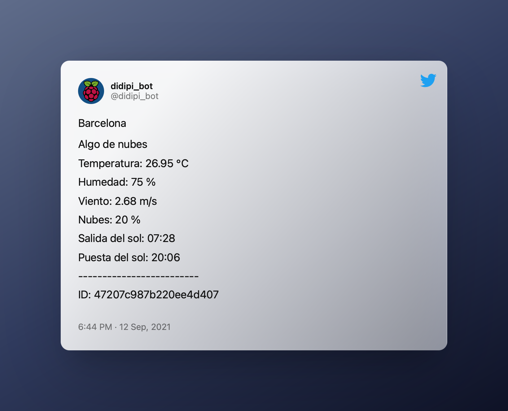

# twitter-openweathermap

This is a Twitter bot maded in Node.js. This bot publishes current weather data of the cities that you choose. Meteorological data are provided by OpenWeatherMap API. 

Example of tweet published by this application: https://twitter.com/didipi_bot/status/1243827584607150081



## Requirements
* Node.js 10 or higher
* A Twitter account and Twitter app registered for use their API
* A registered account on OpenWeatherMap and a token for use their API


## How to use

### Prepare the application:
* Download this repo: https://github.com/didaquis/twitter-openweathermap
* Install dependencies: `npm install`
* You must configure the authentication data of Twitter API and OpenWeatherMap API:
  * Duplicate the configuration file `_env` and rename it as `.env`
  * Write your credentials in file `.env`
* You must edit the file `src/appConfiguration.js` to configure your desired locations. For each city to retrieve data from OpenWeatherMap API you need to create a new object inside `locations`. 
  * Every location must be an object with properties `id` and `timezone`. 
  * The `id` value must be a valid ID value of city. You can see list of ID values of cities on the documentation of OpenWeatherMap API. 
  * The property `timezone` must indicate the timezone of that city.
  ```
  /* Example of configuration */
  // ...
  locations: [
		{
			id: 1111111,
			timezone: 'Europe/Madrid'
		},
		{
			id: 2222222,
			timezone: 'Asia/Tokyo'
		},
		{
			id: 333333,
			timezone: 'Australia/Sydney'
		}
  ]
  // ...
  ```
  * If you wish, you can modify the interval of execution. This value is the number of miliseconds of delay before new execution of code. Recommended value is `1200000` (20 minutes).
* If you want, you can edit the default language of OpenWeatherMap API on the file `src/lib/owm_api/config_api.js`. 

**Warning:** You must keep in mind the API restrictions. For example, you can't publish thousands of tweets in a row or publish the same data over and over again. Both Twitter and OpenWeatherMap impose a series of limitations in their API.

### Execute the application:
* Run the script `npm start`


## For development:
* For run app: `npm run dev` (tweets are not published in development mode)
* For run test: `npm run test`
* For run test and coverage report: `npm run test:coverage`
* For run documentation: `npm run doc-view`
* For delete `doc`, `.nyc_output` and `logs` folders: `npm run purge`
* For run linter: `npm run lint`


## For deployment:
It's a Node.js app, so you can deploy this software almost anywhere: Raspberry Pi, Heroku...


## Useful links

### Timezone identifier
* https://en.wikipedia.org/wiki/List_of_tz_database_time_zones (timezone identifier)

### OpenWeatherMap
* https://openweathermap.org/api (Current Weather Data API)
* To obtain the ID of locations: http://bulk.openweathermap.org/sample/

### Twitter 
* https://apps.twitter.com 
* https://developer.twitter.com/en/docs/basics/getting-started

